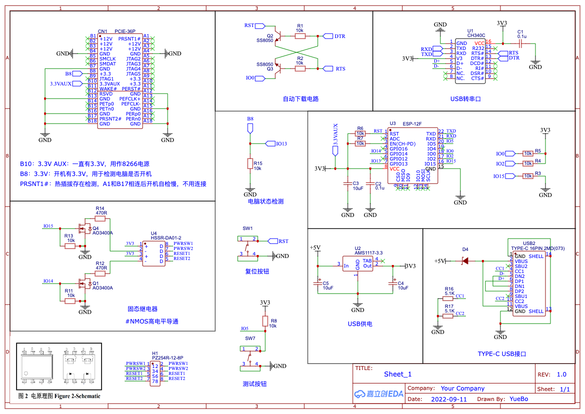
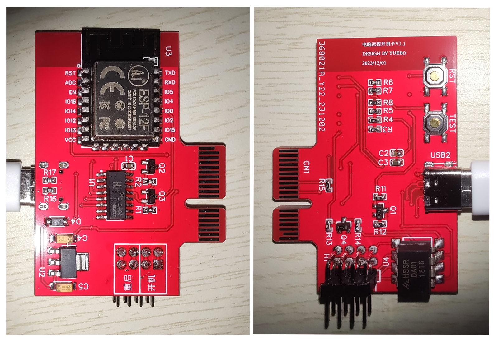
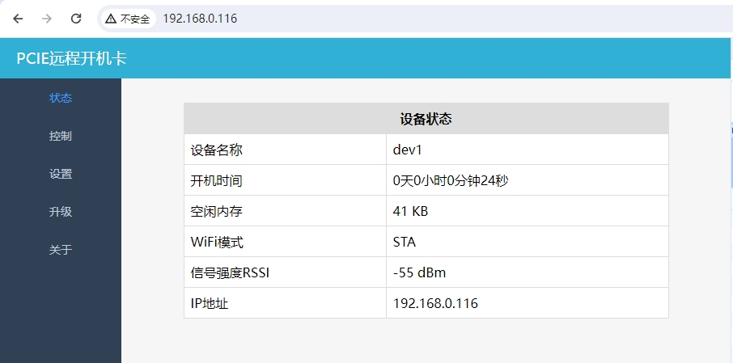
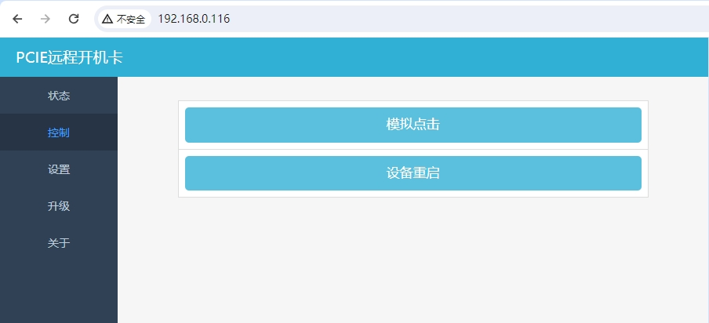
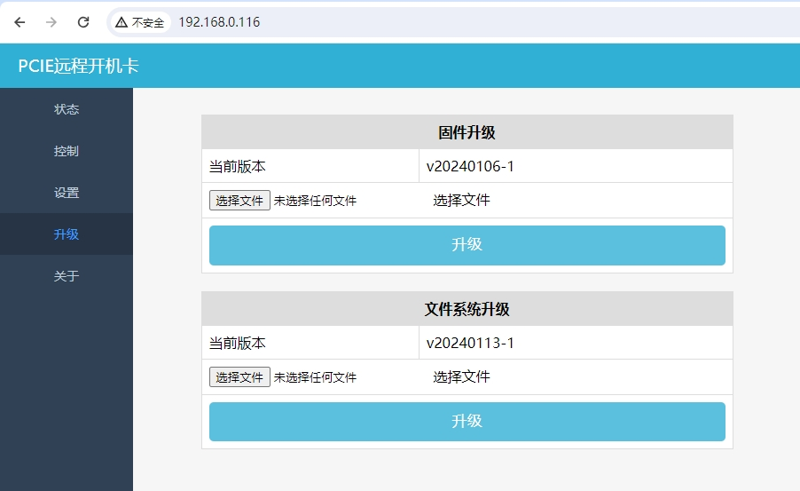
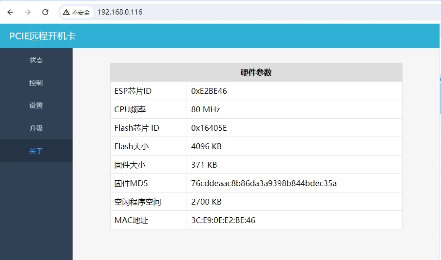

# PcRemoteControll：电脑远程开机卡

#### 介绍
网上有不少开源的电脑开机卡设计，有些是使用光耦进行控制的，光耦单向导通，接线区分正负极。还有些使用立创商城中固态继电器方案的，但是立创商城固态继电器价格非常高。所以自己从淘宝找了一款固态继电器，于是有了本项目。开机卡自己已经在使用了，没有发现问题。本项目也是第一次做，边学边做的，如有错误，欢迎指正。

已实现功能如下：
1. 开机卡可以与原开机按钮并联，开机卡和开机键都可以控制开机。
2. 连接开机键的两根线不区分正负，重启连线也不区分正负极
3. 设备可以直接插入到主板PCI—E接口上，通过PCI-E接口对开机卡进行供电，开机卡通过PCI-E接口识别电脑是否已开机。
4. 也支持通过USB TYPE-C接口供电和烧录程序，可以作为电脑远程开机卡的开发板。
5. 连接腾讯云物联网服务器，支持在腾讯连连小程序内远程遥控开机和查看电脑开机状态。
6. ESP8266作为web服务器，支持局域网通过网页进行固件程序升级，查看设备状态和信息。

#### 项目目录
1. Hardware：Gerber文件，已验证，可直接用于PCB打样。
2. 固件程序源码

#### 原理图

#### 实物图

#### WEB管理后台

